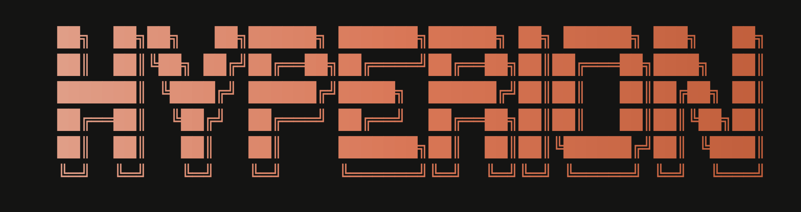
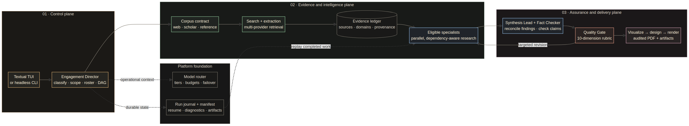
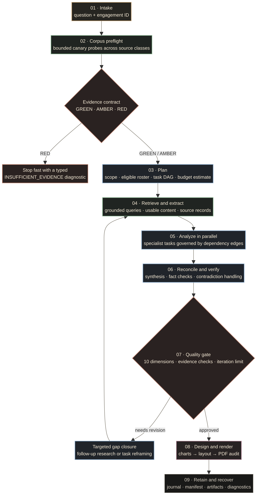

<p align="center">
  
</p>

<p align="center">
  
</p>

> **Multi-Agent Consulting Intelligence**
>
> *orchestration · reasoning · synthesis*

Hyperion is a **research-and-delivery operating system** for high-stakes business questions. It converts a question into a governed engagement: one that establishes whether the available evidence is fit for purpose, assigns only the expertise the question warrants, preserves the trail from source to claim, and refuses to treat a draft as delivery. The Textual terminal interface and the headless CLI are two entry points to the same workflow engine, not separate demonstration surfaces.[1] [2]

> **The design principle:** move from question to client-ready output through explicit gates—not a longer chain of prompts.

## The Hyperion Operating Model

Hyperion is built for the work that sits between an executive question and a defensible recommendation. The system separates **control**, **evidence and intelligence**, and **assurance and delivery** so that a change in model availability, research depth, or presentation requirement does not collapse the entire engagement into an opaque response. Each plane emits durable artifacts that the next plane can inspect, challenge, or resume.[2] [3]



| Operating plane | What the runtime actually does | Why it changes the deliverable |
| --- | --- | --- |
| **Control** | The Engagement Director classifies the question, establishes scope and geography, records eligible and excluded specialist decisions, constructs a dependency-aware task DAG, and estimates work before dispatch. | The team is assembled for the engagement rather than forcing every question through one fixed agent sequence. |
| **Evidence & intelligence** | Corpus preflight probes the configured source classes; retrieval and extraction build an evidence ledger; independent specialist tasks execute in parallel when their dependencies permit. | Findings have a retained provenance path, and research begins with an explicit evidence condition instead of an assumption that sources will be sufficient. |
| **Assurance & delivery** | Synthesis reconciles specialist work, fact checking challenges claims, and the Quality Gate evaluates the assembled work before visualization, presentation design, PDF rendering, and output audit. | The workflow can request targeted gap closure before release and produces a report with purposeful exhibits rather than a raw model transcript. |
| **Platform foundation** | The router applies provider health, capacity, tier, and budget controls; the run journal records completed steps, failures, artifacts, and diagnostics. | Recoverable work remains recoverable: an interruption or provider issue does not automatically discard stages that have already completed. |

This is a deliberately selective system. Hyperion does not claim that every business question needs all twenty specialists, every provider, or every source. The director’s plan ties specialist selection to the question type and eligible methods, while the DAG exposes dependencies, concurrency, estimates, and later adaptation as first-class operational decisions.[3]

## An Engagement Is a Governed Loop

The lifecycle is a decision system, not a linear content-generation pipeline. A `RED` evidence contract stops an engagement with a typed insufficient-evidence diagnostic. `GREEN` and `AMBER` contracts allow scoped work to proceed, but quality approval remains conditional: a weak coverage, contradiction, or claim can route the system back into targeted gap closure rather than quietly passing into design.[2] [9] [10]



| Moment that matters | Runtime control | Engagement consequence |
| --- | --- | --- |
| **Before research** | Corpus preflight performs bounded canary probes across web, scholarly, and reference paths, then returns a typed `GREEN`, `AMBER`, or `RED` contract. | The team learns whether the planned evidence standard is achievable before expensive work begins.[9] |
| **Before specialist dispatch** | The director builds a DAG with explicit dependencies, model tiers, token and call estimates, subject-class gating, and recorded roster decisions. | Parallelism is earned by independence; sequencing is preserved where synthesis or verification requires prior work. |
| **Before release** | Synthesis, independent fact checking, and the ten-dimension Quality Gate assess claims, evidence coverage, contradictions, methodology, and report quality. | The system can approve, iterate, or escalate with a visible reason rather than silently emitting a polished but fragile answer.[10] |
| **After interruption** | The run journal and manifest retain task status, outputs, artifacts, and diagnostics under the engagement run directory. | Operators can inspect or resume deterministic runs instead of restarting completed stages by default.[11] |

### What the reader receives

The client-facing report is the final expression of a traceable operating sequence: scoped research, retained evidence, specialist analysis, synthesis, quality controls, visual exhibits, document design, and render-level checks. The operational trail remains available in the corresponding engagement artifacts, allowing Hyperion to support both executive reading and post-delivery scrutiny.[2] [11]

## Agent Operating Model

The terminal roster groups the same 20 agents used by the runtime into four responsibility areas. Their individual abilities are visible in the TUI through `/agents`.[4]

| Group | Agent | Core responsibility |
| --- | --- | --- |
| **Orchestration** | Engagement Director | Decomposes the objective and routes specialists. |
| **Orchestration** | Synthesis Lead | Reconciles findings into one recommendation. |
| **Specialists** | Market Analyst | Sizes TAM/SAM/SOM and triangulates growth. |
| **Specialists** | Competitive Intel | Maps incumbents, entrants, moats, and share. |
| **Specialists** | Financial Analyst | Evaluates unit economics, capex, margins, and ROI. |
| **Specialists** | Risk Analyst | Assesses policy, supply-chain, and foreign-exchange risk. |
| **Specialists** | Technology Analyst | Examines technology readiness, architecture, and build-versus-buy choices. |
| **Specialists** | Operations Analyst | Reviews footprint, logistics, and operating models. |
| **Specialists** | Regulatory Analyst | Covers licensing, compliance, and incentives. |
| **Specialists** | Sustainability Analyst | Assesses ESG exposure, emissions, and reporting. |
| **Specialists** | Consumer Insights | Examines segments, willingness to pay, and sentiment. |
| **Specialists** | M&A Analyst | Assesses targets, comparables, and synergies. |
| **Specialists** | Innovation Analyst | Tracks emerging technology, patents, and disruption vectors. |
| **Specialists** | Strategy Analyst | Develops entry modes, sequencing, and optionality. |
| **Support** | Research Librarian | Sources and curates web evidence. |
| **Support** | Fact Checker | Verifies claims and flags weak citations. |
| **Support** | Data Visualizer | Builds charts, tables, and comparison matrices. |
| **Support** | Quality Gate | Scores rigor and coverage; rejects thin work. |
| **Delivery** | Presentation Designer | Structures the deck, storyline, and executive summary. |
| **Delivery** | Render Engine | Typesets the final PDF with charts. |

## Quick Start

Hyperion requires **Python 3.12 or later** and declares `uv` as its primary dependency-management workflow.[5] Docker is recommended for the self-hosted retrieval stack. The headless workflow reports a degraded-search warning and continues through configured fallbacks if a container engine is unavailable.[6]

```bash
# Clone and enter the repository
git clone https://github.com/hereugo-ak/Hyperion.git
cd Hyperion

# Install application and development dependencies
uv sync --extra dev

# Create local configuration, then add the provider keys you intend to use
cp .env.example .env

# Preview the terminal interface without live API keys
uv run hyperion shell --demo
```

After configuration, start an interactive session or run an engagement headlessly.

```bash
# Launch the Textual terminal interface
uv run hyperion shell

# Run a complete engagement without the terminal interface
uv run hyperion consult "Should we enter the Tier-2 Indian SaaS market?"

# Attach additional context, choose the PDF destination, and export Markdown
uv run hyperion consult "Assess the European EV charging market" \
  --context "Focus on public charging and strategic entry options." \
  --output reports/ev-charging.pdf \
  --markdown
```

## Using the Interfaces

### Interactive terminal interface

`hyperion shell` is the interactive command bridge. It displays the brand wordmark, roster, boot telemetry, transcript, and live engagement events in one selectable scroll surface. Type a business question directly to begin an engagement; `/consult` is not required.[1]

| Input or shortcut | Result |
| --- | --- |
| `your business question` | Starts an engagement from the terminal prompt. |
| `/agents` | Shows the full agent roster and each agent’s stated capability. |
| `/providers` | Displays current provider status. |
| `/vault <query>` | Searches the Second Brain / Obsidian vault. |
| `/demo` | Runs a simulated engagement without API keys. |
| `/export` or `Ctrl+Shift+S` | Saves the complete terminal transcript under `reports/diagnostics/`. |
| `/clear` or `Ctrl+L` | Resets the session transcript. |
| `/help` or `F1` | Shows in-session help. |
| `Ctrl+Shift+C` / `Ctrl+Shift+A` | Copies selected text / selects the full transcript. |
| `Ctrl+Q` | Tears down managed services and exits the application. |

The interface supports mouse selection and auto-scroll selection. Use `--no-mouse` to preserve a terminal’s native selection behavior, and `--reduced-motion` to disable motion effects.

```bash
uv run hyperion shell --reduced-motion
uv run hyperion shell --no-mouse
```

### Command-line interface

The CLI routes `shell` and `consult` through the same workflow engine while exposing service visibility, recovery, export, and vault retrieval as dedicated operations.[6]

| Command | Purpose | Operational notes |
| --- | --- | --- |
| `hyperion shell` | Launch the interactive terminal interface. | Supports `--demo`, `--reduced-motion`, and `--no-mouse`. |
| `hyperion boot` | Alias for `hyperion shell`. | Use when an operator prefers an explicit boot verb. |
| `hyperion consult <question>` | Run a full engagement non-interactively. | Supports `--context`, `--output`, `--markdown`, and `--fresh`. |
| `hyperion resume <engagement-id-or-question>` | Resume a prior engagement from durable execution state. | A question maps to its deterministic run identifier unless `--fresh` was used. |
| `hyperion providers` | Show provider availability, token capacity, budget, and uptime. | Use before a critical engagement to understand routing health. |
| `hyperion vault <query>` | Search the local Second Brain. | Requires a configured vault integration. |
| `hyperion export <pdf|markdown|json>` | Export the most recent report data or locate the current PDF. | PDF production happens during the consult pipeline. |
| `hyperion health` | Inspect persistent engine-health state. | Add `--reset-engine-state` to clear stored cooldowns. |
| `hyperion help` | Show command help. | `uv run hyperion --help` is the authoritative installed command list. |

## Results, State, and Recovery

Hyperion treats operational state as part of the engagement rather than incidental logs. Report exports and intermediate records are separated so an incomplete process can be inspected or resumed.

| Location | Contents | How to use it |
| --- | --- | --- |
| `artifacts/<run-id>/journal.sqlite` | Durable task journal for a single engagement. | Use `hyperion resume <run-id>` or re-run the same question to replay finished stages. |
| `artifacts/<run-id>/` | Run manifest and workflow artifacts. | Inspect when diagnosing a failed or partial engagement. |
| `reports/` | Generated PDF, Markdown, JSON, and related report outputs. | Use `hyperion export` to retrieve the latest result in a chosen format. |
| `reports/diagnostics/` | TUI transcript exports and operational diagnostics. | Use `/export` or `Ctrl+Shift+S` to save the complete terminal log. |
| `vault/` or configured vault path | Second Brain material and selected persistent state. | Search through `hyperion vault <query>` or the corresponding TUI command. |

By default, `consult` derives a deterministic run identifier from the question. Re-running the same question therefore resumes completed journal steps where possible. Add `--fresh` when the work must start from a new identifier and ignore resumable state.[6]

## Configuration

All configuration is read from environment variables prefixed with `HYPERION_`. Start with `.env.example`; it is the current configuration contract for provider credentials, optional search adapters, workspace paths, and quality controls.[7]

| Area | Common variables | Practical guidance |
| --- | --- | --- |
| **LLM providers** | `HYPERION_GOOGLE_API_KEY`, `HYPERION_NVIDIA_API_KEY`, `HYPERION_CEREBRAS_API_KEY`, `HYPERION_GROQ_API_KEY`, `HYPERION_MISTRAL_API_KEY` | Configure the provider families you want the router to consider. |
| **Self-hosted search** | `HYPERION_SEARXNG_URL`, `HYPERION_FLARESOLVERR_URL` | Use with the local retrieval stack when those services are available. |
| **Web extraction and search APIs** | `HYPERION_FIRECRAWL_URL`, `HYPERION_JINA_API_KEY`, `HYPERION_YOU_API_KEY`, `HYPERION_EXA_API_KEY`, `HYPERION_TAVILY_API_KEY`, `HYPERION_YEP_API_KEY` | Treat these as optional adapters; configure the tools required for your operating environment. |
| **Data sources** | `HYPERION_ALPHA_VANTAGE_API_KEY`, `HYPERION_FRED_API_KEY`, `HYPERION_SEMANTIC_SCHOLAR_API_KEY`, `HYPERION_OPENALEX_EMAIL`, `HYPERION_UNSPLASH_ACCESS_KEY` | Enable only the sources needed for the engagement types you run. |
| **Workspace and quality** | `HYPERION_VAULT_PATH`, `HYPERION_REPORTS_DIR`, `HYPERION_ASSETS_DIR`, `HYPERION_QUALITY_THRESHOLD` | Use absolute, writable paths where appropriate; settings validation resolves configured locations. |

The router declares Google AI Studio, NVIDIA NIM, Cerebras, Groq, and Mistral provider families. The research layer has adapters for search, web extraction, economic and financial datasets, scholarly sources, social sources, image retrieval, and archived material. Actual availability is environment-dependent, so `hyperion providers` and boot telemetry are the correct operational checks for a particular installation.[7]

## Managed Retrieval Services

The repository includes a hardened local retrieval composition: Valkey plus three disjoint SearXNG profiles for scholarly, reference, and web search. Each SearXNG profile is bound to loopback only and has its own health check, cache volume, and settings file. An optional FlareSolverr service is exposed through the `investigation` profile. Firecrawl is intentionally configured as an external/self-hosted service rather than being composed in this repository.[8]

| Service | Purpose | Default local endpoint |
| --- | --- | --- |
| **Valkey** | Shared cache and supporting state for the retrieval stack. | Internal Docker network |
| **SearXNG scholar** | Scholarly-focused metasearch profile. | `http://127.0.0.1:8888` |
| **SearXNG reference** | Reference-focused metasearch profile. | `http://127.0.0.1:8889` |
| **SearXNG web** | General-web metasearch profile. | `http://127.0.0.1:8890` |
| **FlareSolverr** | Optional investigation-mode browser challenge helper. | `http://127.0.0.1:8191` |

The application boot path owns normal service startup and shutdown. Operators who start the compose stack manually should satisfy the required `SEARXNG_*_SECRET` environment variables and verify the service health checks before beginning a time-sensitive engagement.[8]

## Repository Map

The repository contains **176 Python application modules**, **144 test modules**, and supporting documentation, service configuration, and assets. The directories below are the principal maintenance surfaces.

```text
Hyperion/
├── assets/brand/    # User-supplied logo and generated TUI wordmark SVG
├── hyperion/
│   ├── agents/      # Director, specialists, synthesis, support, and delivery agents
│   ├── router/      # Provider routing, capacity, budgets, and failover
│   ├── search/      # Search orchestration, adapters, cost, and query planning
│   ├── tools/       # Source clients, extraction, evidence, and utility layers
│   ├── output/      # Markdown, charts, images, layout, and PDF production
│   ├── tui/         # Textual app, brand banner, boot, screens, and widgets
│   ├── infra/       # Project paths and local-service lifecycle management
│   ├── obs/         # Run journal, manifests, health, and observability
│   ├── schemas/     # Typed workflow, research, narrative, and report contracts
│   ├── orchestrator.py
│   ├── config.py
│   └── cli.py
├── docs/            # Design, remediation, and operational documentation
├── tests/           # Unit, integration, regression, TUI, and output-quality tests
├── tools/           # Developer automation, probes, and asset generators
├── .env.example     # Environment configuration template
├── docker-compose.yml
└── pyproject.toml
```

## Development and Validation

Use the development extra when executing test and lint tooling. The test suite covers workflow and agent contracts, provider routing, evidence controls, TUI interaction, report rendering, output validation, and regression scenarios.

```bash
# Run the complete suite
uv run --extra dev pytest -q

# Run lint checks
uv run --extra dev ruff check .

# Regenerate and inspect the README wordmark after a brand-source change
uv run python tools/generate_tui_wordmark_svg.py
git diff --check
```

For a fast interface-focused verification pass, run the TUI test modules that exercise transcript selection, transcript export, and live telemetry.

```bash
uv run --extra dev pytest -q \
  tests/test_tui_log_export.py \
  tests/test_transcript_selection.py \
  tests/test_tui_live_telemetry.py
```

## License

This project is proprietary. © HYPERION Consulting.

## Implementation References

[1]: ./hyperion/tui/banner.py "Locked terminal wordmark, static gradient rule, and interactive banner"
[2]: ./hyperion/orchestrator.py "WorkflowEngine and full engagement pipeline"
[3]: ./hyperion/agents/engagement_director.py "Question decomposition, roster selection, and engagement DAG construction"
[4]: ./hyperion/tui/roster.py "Authoritative agent roster and responsibilities"
[5]: ./pyproject.toml "Project metadata, Python requirement, dependencies, and command entry point"
[6]: ./hyperion/cli.py "CLI commands, service bootstrap, output, and resume behavior"
[7]: ./hyperion/config.py "Settings schema, providers, search adapters, paths, and quality controls"
[8]: ./docker-compose.yml "Local retrieval services, profiles, ports, health checks, and hardening"
[9]: ./hyperion/agents/support/corpus_preflight.py "Corpus evidence contract and preflight controls"
[10]: ./hyperion/agents/support/quality_gate.py "Quality rubric, review loop, and approval controls"
[11]: ./hyperion/obs/run_journal.py "Durable run state, replay, artifacts, and diagnostics"
