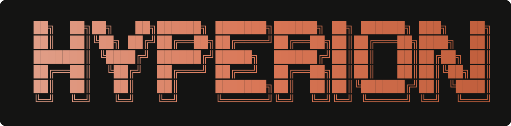
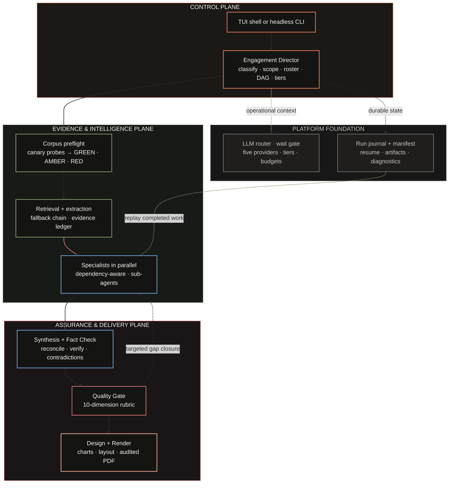
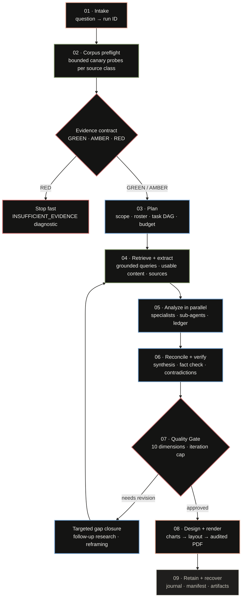

<p align="center">
  
</p>

<p align="center">
  
</p>

<p align="center">
  <strong>Multi-Agent Consulting Intelligence</strong><br>
  <em>orchestration&nbsp;&nbsp;·&nbsp;&nbsp;reasoning&nbsp;&nbsp;·&nbsp;&nbsp;synthesis</em>
</p>

<p align="center">
  
  
  
  
  
  
  
  
  
  
  
</p>

<p align="center">
  
  
  
  
  
  
  
  
  
  
  
  
  
  
</p>

<p align="center">
  
  
  
  
  
  
  
  
  
  
  
</p>

Hyperion is a **research-and-delivery operating system** for high-stakes business questions. It converts a question into a governed engagement: one that establishes whether the available evidence is fit for purpose, assigns only the expertise the question warrants, preserves the trail from source to claim, and refuses to treat a draft as delivery. The Textual terminal interface and the headless CLI are two entry points to the same workflow engine, not separate demonstration surfaces.[1] [2]

The engine behind that workflow is substantial: **20 agents** (2 orchestrators, 12 specialists, 4 support, 2 delivery), **176 Python modules** and **149 test files**, with a free-tier-first model router, a hardened self-hosted retrieval stack, and a 300 DPI PDF production pipeline. It runs entirely on free-tier LLM capacity and is designed to finish an engagement in minutes, not hours.[5]

> **The design principle:** move from question to client-ready output through explicit gates, not a longer chain of prompts.

## The Hyperion Operating Model

Hyperion is built for the work that sits between an executive question and a defensible recommendation. The system separates **control**, **evidence and intelligence**, and **assurance and delivery** so that a change in model availability, research depth, or presentation requirement does not collapse the entire engagement into an opaque response. Each plane emits durable artifacts that the next plane can inspect, challenge, or resume.[2] [3]

The planes are responsibilities with distinct failure modes, not stages of a pipeline. The control plane decides what to do and in what order. The evidence and intelligence plane decides what is true and what supports it. The assurance and delivery plane decides what the client sees and whether it is defensible. The platform foundation keeps all three honest: it routes model traffic around capacity limits, records what happened, and makes finished work resumable.[2] [7] [12]



| Operating plane | What the runtime actually does | Why it changes the deliverable |
| --- | --- | --- |
| **Control** | The Engagement Director classifies the question into six types, establishes scope and geography, records eligible and excluded specialist decisions, constructs a dependency-aware task DAG, assigns model tiers, and estimates token and call budgets before dispatch. Work is dispatched over the AgentBus, an in-process async pub/sub that carries status, findings, requests, escalations, and handoffs between agents.[3] | The team is assembled for the engagement rather than forcing every question through one fixed agent sequence, and the bus lets the Director adapt the roster mid-flight when an agent escalates. |
| **Evidence & intelligence** | Corpus preflight probes web, scholarly, and reference paths before work begins and returns a typed `GREEN`, `AMBER`, or `RED` contract. Retrieval runs a deterministic fallback chain (SearXNG, You.com, Exa, Tavily, Yep), and every fetched URL becomes a first-class evidence record in the run-scoped ledger before any model sees it. Extraction climbs a capability-gated ladder (HTTP, Jina reader, stealth browsers, Crawl4AI, Firecrawl, FlareSolverr). Specialist tasks execute in parallel when their dependencies permit, and a specialist can spawn junior sub-agents for context-isolated deep dives.[9] [13] [14] | Findings have a retained provenance path from URL to claim, and research begins with an explicit evidence condition instead of an assumption that sources will be sufficient. |
| **Assurance & delivery** | Synthesis reconciles specialist findings, classifies contradictions as data, interpretation, or scope conflicts, and drafts one recommendation. Fact checking verifies claims against the ledger and flags weak citations. The Quality Gate scores the work on a ten-dimension rubric and either approves it, sends it back for targeted gap closure, or escalates. Presentation design, visualization, and the render engine then produce the 300 DPI PDF with embedded fonts and audited output.[2] [10] | The workflow can request targeted gap closure before release and produces a report with purposeful exhibits rather than a raw model transcript. |
| **Platform foundation** | The router tracks RPM, TPM, and RPD in sliding windows across five OpenAI-compatible provider families, predicts capacity pressure before a 429 occurs, applies tier, budget, and circuit-breaker controls, and rotates providers by remaining capacity. The run journal records every completed step, failure, artifact, and diagnostic in an append-only SQLite history under the engagement run directory.[12] [11] | Recoverable work remains recoverable: an interruption or provider issue does not automatically discard stages that have already completed, and re-running a question resumes finished steps. |

This is a deliberately selective system. Hyperion does not claim that every business question needs all twenty specialists, every provider, or every source. The director's plan ties specialist selection to the question type and eligible methods, while the DAG exposes dependencies, concurrency, estimates, and later adaptation as first-class operational decisions. The platform foundation exists for the cases where the plan is wrong or the environment changes: the system can explain what it did, what it used, and what it already finished.[3] [11]
## An Engagement Is a Governed Loop

An engagement is a decision system, not a linear content-generation pipeline. Every step is a gate that can stop the run, narrow its scope, or route it back for targeted work. The corpus contract is settled before research begins: a `RED` contract terminates the engagement in seconds with a typed `INSUFFICIENT_EVIDENCE` diagnostic, instead of letting a dead retrieval stack burn tokens and minutes. `GREEN` and `AMBER` contracts allow scoped work to proceed, but quality approval remains conditional: a weak coverage, contradiction, or claim can route the system back into targeted gap closure rather than quietly passing into design.[2] [9] [10]



| Moment that matters | Runtime control | Engagement consequence |
| --- | --- | --- |
| **Before research** | Corpus preflight fires bounded canary probes across web, scholarly, and reference paths, then returns a typed `GREEN`, `AMBER`, or `RED` contract. A `RED` contract raises immediately and refuses to start an ungrounded engagement.[9] | The team learns whether the planned evidence standard is achievable before expensive work begins; an engagement that cannot produce evidence does not begin. |
| **Before specialist dispatch** | The director builds a DAG with explicit dependencies, model tiers, token and call estimates, subject-class gating, and recorded roster decisions. Independent tasks queue for parallel execution through the AgentBus.[3] | Parallelism is earned by independence; sequencing is preserved where synthesis or verification requires prior work. |
| **Before release** | Synthesis reconciles findings, fact checking verifies claims against the evidence ledger, and the ten-dimension Quality Gate scores coverage, contradictions, methodology, and report quality. Failing work loops back into targeted gap closure, not into design.[10] | The system can approve, iterate, or escalate with a visible reason rather than silently emitting a polished but fragile answer. |
| **After interruption** | The run journal and manifest retain task status, outputs, artifacts, and diagnostics under the engagement run directory. The same question maps to the same deterministic run identifier.[11] | Operators can inspect or resume deterministic runs instead of restarting completed stages by default. |

### What the reader receives

The client-facing report is the final expression of a traceable operating sequence: scoped research, retained evidence, specialist analysis, synthesis, quality controls, visual exhibits, document design, and render-level checks. The operational trail remains available in the corresponding engagement artifacts, allowing Hyperion to support both executive reading and post-delivery scrutiny.[2] [11]
## Agent Operating Model

The terminal roster groups the same 20 agents used by the runtime into four responsibility areas: **2 orchestrators, 12 specialists, 4 support agents, and 2 delivery agents**. Their individual abilities are visible in the TUI through `/agents`.[4] No agent is decorative. Every agent carries a named role, a model tier, an explicit tool list, proprietary analytical skills, and a structured output contract, so the Synthesis Lead, Fact Checker, and Quality Gate can reconcile, challenge, and score work programmatically instead of re-reading prose.

| Group | Agent | Core responsibility |
| --- | --- | --- |
| **Orchestration** | Engagement Director | Decomposes the objective and routes specialists. |
| **Orchestration** | Synthesis Lead | Reconciles findings into one recommendation. |
| **Specialists** | Market Analyst | Sizes TAM/SAM/SOM and triangulates growth. |
| **Specialists** | Competitive Intel | Maps incumbents, entrants, moats, and share. |
| **Specialists** | Financial Analyst | Evaluates unit economics, capex, margins, and ROI. |
| **Specialists** | Risk Analyst | Assesses policy, supply-chain, and foreign-exchange risk. |
| **Specialists** | Technology Analyst | Examines technology readiness, architecture, and build-versus-buy choices. |
| **Specialists** | Operations Analyst | Reviews footprint, logistics, and operating models. |
| **Specialists** | Regulatory Analyst | Covers licensing, compliance, and incentives. |
| **Specialists** | Sustainability Analyst | Assesses ESG exposure, emissions, and reporting. |
| **Specialists** | Consumer Insights | Examines segments, willingness to pay, and sentiment. |
| **Specialists** | M&A Analyst | Assesses targets, comparables, and synergies. |
| **Specialists** | Innovation Analyst | Tracks emerging technology, patents, and disruption vectors. |
| **Specialists** | Strategy Analyst | Develops entry modes, sequencing, and optionality. |
| **Support** | Research Librarian | Sources and curates web evidence. |
| **Support** | Fact Checker | Verifies claims and flags weak citations. |
| **Support** | Data Visualizer | Builds charts, tables, and comparison matrices. |
| **Support** | Quality Gate | Scores rigor and coverage; rejects thin work. |
| **Delivery** | Presentation Designer | Structures the deck, storyline, and executive summary. |
| **Delivery** | Render Engine | Typesets the final PDF with charts. |

> **Delegation, not truncation.** A specialist that needs deeper research spawns a junior sub-agent with a focused sub-question. The sub-agent researches inside its own context window and returns structured findings with sources and confidence; the parent synthesizes. Context limits are handled by delegation, never by compressing evidence, and the Director adapts the roster mid-engagement when an agent escalates something unexpected.

## Quick Start

**Requirements:** Python 3.12 or later, `uv` as the package manager, and Docker (recommended) for the self-hosted retrieval stack. The headless workflow degrades gracefully: without a container engine it reports a degraded-search warning and continues through configured fallbacks.[5] [6]

```bash
# 1 · Get the code
git clone https://github.com/hereugo-ak/Hyperion.git
cd Hyperion

# 2 · Install application and development dependencies
uv sync --extra dev

# 3 · Create local configuration, then add the provider keys you intend to use
cp .env.example .env

# 4 · Preview the terminal interface without live API keys
uv run hyperion shell --demo
```

For full retrieval depth, start the managed search stack (see Managed Retrieval Services) and verify it with `hyperion health`. Then launch an interactive session, or run a complete engagement headlessly in one command.

```bash
# Launch the Textual terminal interface
uv run hyperion shell

# Run a complete engagement without the terminal interface
uv run hyperion consult "Should we enter the Tier-2 Indian SaaS market?"

# Attach additional context, choose the PDF destination, and export Markdown
uv run hyperion consult "Assess the European EV charging market" \
  --context "Focus on public charging and strategic entry options." \
  --output reports/ev-charging.pdf \
  --markdown
```

## Using the Interfaces

### Interactive terminal interface

`hyperion shell` is the interactive command bridge: the brand wordmark, the full agent roster, boot telemetry, the live transcript, and engagement events all live in one selectable scroll surface. Type a business question directly to begin an engagement; `/consult` is not required.[1]

| Input or shortcut | Result |
| --- | --- |
| `your business question` | Starts an engagement from the terminal prompt. |
| `/agents` | Shows the full agent roster and each agent's stated capability. |
| `/providers` | Displays current provider status. |
| `/vault <query>` | Searches the Second Brain / Obsidian vault. |
| `/demo` | Runs a simulated engagement without API keys. |
| `/export` or `Ctrl+Shift+S` | Saves the complete terminal transcript under `reports/diagnostics/`. |
| `/clear` or `Ctrl+L` | Resets the session transcript. |
| `/help` or `F1` | Shows in-session help. |
| `Ctrl+Shift+C` / `Ctrl+Shift+A` | Copies selected text / selects the full transcript. |
| `Ctrl+Q` | Tears down managed services and exits the application. |

The interface supports mouse selection and auto-scroll selection. Use `--no-mouse` to preserve a terminal's native selection behavior, and `--reduced-motion` to disable motion effects for accessibility.

```bash
uv run hyperion shell --reduced-motion
uv run hyperion shell --no-mouse
```

### Command-line interface

The CLI routes `shell` and `consult` through the same workflow engine while exposing service visibility, recovery, export, and vault retrieval as dedicated operations.[6]

| Command | Purpose | Operational notes |
| --- | --- | --- |
| `hyperion shell` | Launch the interactive terminal interface. | Supports `--demo`, `--reduced-motion`, and `--no-mouse`. |
| `hyperion boot` | Alias for `hyperion shell`. | Use when an operator prefers an explicit boot verb. |
| `hyperion consult <question>` | Run a full engagement non-interactively. | Supports `--context`, `--output`, `--markdown`, and `--fresh`. |
| `hyperion resume <engagement-id-or-question>` | Resume a prior engagement from durable execution state. | A question maps to its deterministic run identifier unless `--fresh` was used. |
| `hyperion providers` | Show provider availability, token capacity, budget, and uptime. | Use before a critical engagement to understand routing health. |
| `hyperion vault <query>` | Search the local Second Brain. | Requires a configured vault integration. |
| `hyperion export <pdf|markdown|json>` | Export the most recent report data or locate the current PDF. | PDF production happens during the consult pipeline. |
| `hyperion health` | Inspect persistent engine-health state. | Add `--reset-engine-state` to clear stored cooldowns. |
| `hyperion help` | Show command help. | `uv run hyperion --help` is the authoritative installed command list. |

## Results, State, and Recovery

Hyperion treats operational state as part of the engagement, not as incidental logs. Finished reports and intermediate records are kept apart, so an incomplete process can be inspected, diagnosed, and resumed without replaying completed work.[11]

| Location | Contents | How to use it |
| --- | --- | --- |
| `artifacts/<run-id>/journal.sqlite` | Durable task journal for a single engagement. | Use `hyperion resume <run-id>` or re-run the same question to replay finished stages. |
| `artifacts/<run-id>/` | Run manifest and workflow artifacts. | Inspect when diagnosing a failed or partial engagement. |
| `reports/` | Generated PDF, Markdown, JSON, and related report outputs. | Use `hyperion export` to retrieve the latest result in a chosen format. |
| `reports/diagnostics/` | TUI transcript exports and operational diagnostics. | Use `/export` or `Ctrl+Shift+S` to save the complete terminal log. |
| `vault/` or configured vault path | Second Brain material and selected persistent state. | Search through `hyperion vault <query>` or the corresponding TUI command. |

By default, `consult` derives a deterministic run identifier from the question. Re-running the same question therefore resumes completed journal steps where possible. Add `--fresh` when the work must start from a new identifier and ignore resumable state.[6]

## Configuration

All configuration is read from environment variables prefixed with `HYPERION_`. Start from `.env.example`: it is the current configuration contract for provider credentials, search adapters, workspace paths, and quality controls. An empty key simply disables the adapter it feeds.[7]

| Area | Common variables | Practical guidance |
| --- | --- | --- |
| **LLM providers** | `HYPERION_GOOGLE_API_KEY`, `HYPERION_NVIDIA_API_KEY`, `HYPERION_CEREBRAS_API_KEY`, `HYPERION_GROQ_API_KEY`, `HYPERION_MISTRAL_API_KEY` | Configure the provider families you want the router to consider. All five expose OpenAI-compatible endpoints; the router falls back across them per model tier. |
| **Self-hosted search** | `HYPERION_SEARXNG_URL`, `HYPERION_FLARESOLVERR_URL` | Use with the local retrieval stack when those services are available. |
| **Search fallback chain** | `HYPERION_YOU_API_KEY`, `HYPERION_EXA_API_KEY`, `HYPERION_TAVILY_API_KEY`, `HYPERION_YEP_API_KEY` | The deterministic chain SearXNG → You.com → Exa → Tavily → Yep; empty keys disable that adapter. |
| **Web extraction** | `HYPERION_FIRECRAWL_URL`, `HYPERION_JINA_API_KEY`, `HYPERION_OBSCURA_PATH` | Extraction uses a capability-gated ladder: HTTP, Jina reader, stealth browsers (Obscura, camoufox, nodriver), Crawl4AI, Scrapling, Firecrawl, FlareSolverr. |
| **Data sources** | `HYPERION_ALPHA_VANTAGE_API_KEY`, `HYPERION_FRED_API_KEY`, `HYPERION_SEMANTIC_SCHOLAR_API_KEY`, `HYPERION_OPENALEX_EMAIL`, `HYPERION_UNSPLASH_ACCESS_KEY` | Enable only the sources needed for the engagement types you run. |
| **Workspace and quality** | `HYPERION_VAULT_PATH`, `HYPERION_REPORTS_DIR`, `HYPERION_ASSETS_DIR`, `HYPERION_QUALITY_THRESHOLD`, `HYPERION_MAX_QUALITY_ITERATIONS` | Use absolute, writable paths where appropriate; settings validation resolves configured locations. |
| **Routing and budgets** | `HYPERION_BUDGET_RESERVE`, `HYPERION_RATE_LIMIT_COOLDOWN`, `HYPERION_CIRCUIT_BREAKER_THRESHOLD`, `HYPERION_MAX_ENGAGEMENT_DURATION` | Tune provider reserve margins, cooldowns, and per-engagement time bounds. |
| **Sub-agents** | `HYPERION_SUB_AGENT_TIMEOUT`, `HYPERION_MAX_SUB_AGENTS`, `HYPERION_SUB_AGENT_CONCURRENT_MAX` | Bound the depth and concurrency of junior research agents spawned by specialists. |

The router declares Google AI Studio, NVIDIA NIM, Cerebras, Groq, and Mistral provider families. The research layer has adapters for search, web extraction, economic and financial datasets, scholarly sources, social sources, image retrieval, and archived material. Actual availability is environment-dependent, so `hyperion providers` and boot telemetry are the correct operational checks for a particular installation.[7]

## Managed Retrieval Services

The repository includes a hardened local retrieval composition: Valkey plus three disjoint SearXNG profiles for scholarly, reference, and web search. Each SearXNG profile is bound to loopback only and has its own health check, cache volume, and settings file. Containers run read-only with dropped capabilities and no-new-privileges; each replica requires its own `SEARXNG_*_SECRET`. An optional FlareSolverr service is exposed through the `investigation` profile. Firecrawl is intentionally configured as an external/self-hosted service rather than being composed in this repository.[8]

| Service | Purpose | Default local endpoint |
| --- | --- | --- |
| **Valkey** | Shared cache and supporting state for the retrieval stack. | Internal Docker network |
| **SearXNG scholar** | Scholarly-focused metasearch profile. | `http://127.0.0.1:8888` |
| **SearXNG reference** | Reference-focused metasearch profile. | `http://127.0.0.1:8889` |
| **SearXNG web** | General-web metasearch profile. | `http://127.0.0.1:8890` |
| **FlareSolverr** | Optional investigation-mode browser challenge helper. | `http://127.0.0.1:8191` |

The application boot path owns normal service startup and shutdown, so `hyperion shell` and `hyperion consult` bring the stack up and tear it down themselves. Operators who start the compose stack manually should satisfy the required `SEARXNG_*_SECRET` environment variables and verify the service health checks before a time-sensitive engagement.[8]

> **Hardened by default.** Every container runs with a read-only root filesystem, dropped Linux capabilities, no-new-privileges, and loopback-only port binding; the three SearXNG replicas keep disjoint engine sets so they add capacity and fault isolation, not shared ban risk.

## Repository Map

The repository contains **176 Python application modules**, **149 test files** (about 96,000 lines of application code and 41,000 lines of test code), plus supporting documentation, service configuration, and assets. The directories below are the principal maintenance surfaces.

```text
Hyperion/
├── assets/brand/    # Logo, generated wordmark SVG/PNG, and brand assets
├── assets/diagrams/ # Source-controlled Mermaid diagrams and rendered PNGs
├── hyperion/
│   ├── agents/      # Director, 12 specialists, synthesis, support, delivery, sub-agents
│   ├── router/      # Provider routing, wait gate, budgets, circuit breakers, failover
│   ├── search/      # Search orchestration, adapters, budget buckets, suspension
│   ├── tools/       # Source clients, unified extraction ladder, evidence ledger
│   ├── output/      # Markdown, charts, images, layout, and PDF production
│   ├── tui/         # Textual app, brand banner, boot, screens, and widgets
│   ├── obs/         # Run journal, manifests, artifact store, health, tracing
│   ├── schemas/     # Typed workflow, research, narrative, and report contracts
│   ├── eval/        # CI gate, canaries, KPI harness
│   ├── infra/       # Project paths and local-service lifecycle management
│   ├── orchestrator.py
│   ├── config.py
│   └── cli.py
├── docs/            # Design, remediation, and operational documentation
├── tests/           # Unit, integration, regression, TUI, and output-quality tests
├── tools/           # Developer automation, probes, and asset generators
├── themes/          # Textual color themes (graphite, midnight)
├── .env.example     # Environment configuration template
├── docker-compose.yml
└── pyproject.toml
```

## Development and Validation

Use the development extra when executing test and lint tooling. The suite covers workflow and agent contracts, provider routing, evidence controls, TUI interaction, report rendering, output validation, and regression scenarios. Linting runs under ruff with a strict rule set (blind `except` and silent swallows fail the gate), typing runs under mypy in strict mode, and a fault-injection canary suite exercises the exact failure paths that historically broke the pipeline.

> **The gate is the process, not an afterthought.** The same checks that protect CI run locally through pre-commit, so a finding that hides a live outage cannot land on the branch.

```bash
# Run the complete suite
uv run --extra dev pytest -q

# Run lint checks
uv run --extra dev ruff check .

# Run the enforced CI gate and fault-injection canaries
uv run --extra dev python -m hyperion.eval.ci_gate --lint
uv run --extra dev python -m hyperion.eval.canaries

# Regenerate and inspect the README wordmark after a brand-source change
uv run python tools/generate_tui_wordmark_svg.py
git diff --check
```

For a fast interface-focused verification pass, run the TUI test modules that exercise transcript selection, transcript export, and live telemetry.

```bash
uv run --extra dev pytest -q \
  tests/test_tui_log_export.py \
  tests/test_transcript_selection.py \
  tests/test_tui_live_telemetry.py
```

## License

This project is proprietary and closed source. © HYPERION Consulting.

## Implementation References

[1]: ./hyperion/tui/banner.py "Locked terminal wordmark, static gradient rule, and interactive banner"
[2]: ./hyperion/orchestrator.py "WorkflowEngine and full engagement pipeline"
[3]: ./hyperion/agents/engagement_director.py "Question decomposition, roster selection, and engagement DAG construction"
[4]: ./hyperion/tui/roster.py "Authoritative agent roster and responsibilities"
[5]: ./pyproject.toml "Project metadata, Python requirement, dependencies, and command entry point"
[6]: ./hyperion/cli.py "CLI commands, service bootstrap, output, and resume behavior"
[7]: ./hyperion/config.py "Settings schema, providers, search adapters, paths, and quality controls"
[8]: ./docker-compose.yml "Local retrieval services, profiles, ports, health checks, and hardening"
[9]: ./hyperion/agents/support/corpus_preflight.py "Corpus evidence contract and preflight controls"
[10]: ./hyperion/agents/support/quality_gate.py "Quality rubric, review loop, and approval controls"
[11]: ./hyperion/obs/run_journal.py "Durable run state, replay, artifacts, and diagnostics"
[12]: ./hyperion/router/wait_gate.py "Predictive provider routing, capacity windows, and failover"
[13]: ./hyperion/search/orchestrator.py "Deterministic search fallback chain and budget buckets"
[14]: ./hyperion/tools/unified_extract.py "Capability-gated extraction ladder"
[15]: ./hyperion/tools/evidence_ledger.py "Source-to-claim provenance ledger"
[16]: ./hyperion/tools/second_brain.py "Obsidian vault retrieval and cross-engagement memory"
[17]: ./hyperion/tools/vector_brain.py "SQLite vector embeddings for the Second Brain"
[18]: ./hyperion/infra/preflight.py "Research-stack preflight and engagement refusal"
